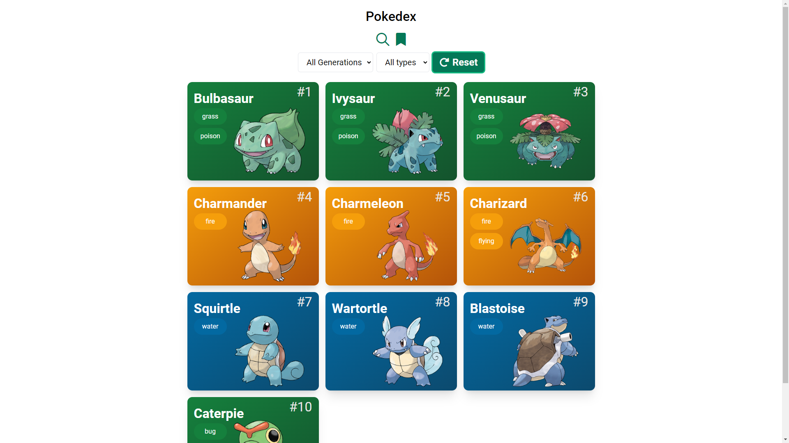

# theFlurn Pokedex Project for Geekster MERN Stack Placement Module #7



## Hosted Version of the Project:

[theFlurn Pokedex Project](https://theflurn-pokedex-project.vercel.app/)

## Objectives
build a Pokédex using a [Poke API](https://pokeapi.co/) to fetch the data. 

## Features 
### Search Page 
+ Created a search page that accepts a Pokemon name to search for. On hitting search, make an API call to the search endpoint.
+ Shows a loading when the API is in progress and stop the loading when the API is successful or throws an error. Display the error if there is an error message.

### Listing page 
+ If the API returns successfully shows all the Pokemon that are returned in the API on this page. 
+ Navigate to the listing page only after a successful API response. This page should show the images of the movie as well as the title of the movie in a grid format. 
+ The listing page is infinite scrollable, as the user scrolls, load more Pokemon using the API. By default, the search API gets 10 items per page.
+ listing page remains functional even after loading a lot of movies when you keep scrolling. 
+ provided options to filter the results by abilities, characteristics, group, habitat, location, Species etc.

### Details Page 
+ Details screen opens up on tapping on one of the Pokemon on the listing screen. 
+ Show all the details got by the API in a properly formatted design. 
+ Display a bookmark icon, tapping on it should save this Pokemon as a favourite on the device itself. 
+ A Pokemon that has been bookmarked should be shown with a prefilled bookmark icon. Clicking on the same icon should remove it from bookmarks.
  
### Bookmarks Screen 
+ The bookmark screen shows all the users bookmarked Pokemon. This data is stored locally on the phone. 
+ Users should be able to remove a Pokemon from bookmarks as well. 


## How to install and run in yours local machine

```bash
npm install
npm run start
```

## Tech. Stack Used:

- [React](https://react.dev/)
- [TailwindCSS](https://tailwindcss.com/)
- [Google Fonts](https://fonts.google.com/)
- [Font Awesome](https://fontawesome.com/icons/)

## Author

[Abhishek kumar](https://www.linkedin.com/in/alex21c/), ([Geekster](https://geekster.in/) MERN Stack FS-14 Batch)
